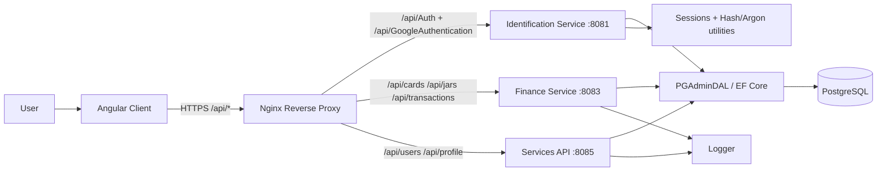

# SplitPay (HackKosice2026)

SplitPay is a full-stack prototype that helps users organize money into personal and shared "pockets" (jars), so group finance scenarios become simple and collaborative.

## Architecture Monitoring (Current State)

The repository is structured as a microservice-style backend with an Angular client:

- `Client` - Angular frontend (pages for auth, dashboard, cards, jars, transfers, profile, friends).
- `Server/Identification` - authentication and onboarding (`/api/Auth`, `/api/GoogleAuthentication`) on `8081`.
- `Server/FinanceService` - cards, jars, transactions (`/api/cards`, `/api/jars`, `/api/transactions`) on `8083`.
- `Server/Services` - user/profile domain (`/api/users`, `/api/profile`) on `8085`.
- `Server/PGAdminDAL` + `Server/SessionService` - shared data access + user/session resolving utilities.
- `nginx.conf` - TLS reverse proxy routing `/api/*` to the correct backend service.

### Architecture Diagram

## Inspiration

The idea came from real everyday frustration with how fragmented modern banking has become. Today, most people do not rely on a single bank or even a single card - they often manage multiple accounts across different banks and even different countries. This creates unnecessary complexity in managing personal finances, where each card is linked to a specific purpose (online shopping, salary, etc.).

The problem becomes especially clear in situations such as:

- collecting money for trips or shared experiences with friends
- splitting expenses in group activities
- organizing family budgets
- saving for multiple goals at the same time

Instead of being simple, these scenarios often turn into a mess of transfers, IBAN exchanges, reminders, and manual tracking.

This is where the idea was born: to create a unified financial layer where users do not just store money, but organize it into goal-based "pockets" that can be easily created, shared, and managed.

The goal is to transform scattered accounts and disconnected banking experiences into a structured, social, and intuitive system for financial planning and collaboration.

## What It Does

The idea behind this product is to rethink how people manage money in a world where financial lives are fragmented across multiple banks, cards, and even countries. Today, simple everyday situations - like planning a trip with friends, splitting shared expenses, or organizing a family budget - often become unnecessarily complicated because funds are scattered across different accounts and systems.

This product introduces a unified digital layer on top of existing bank accounts. Users connect their cards and banks, then can instantly create flexible "money pockets" (virtual envelopes) for any purpose - vacation, rent, utilities, birthdays, going out, savings goals, or anything else.

Each pocket can be:

- Personal, for tracking and organizing your own spending and savings.
- Shared, where you invite friends or family to contribute a defined amount for a specific goal.
- Collaborative, where multiple incomes and cards are logically combined into a single shared budget view.

For shared expenses, the system automatically handles fairness and distribution logic - such as splitting payments between linked cards, or coordinating contributions without manual transfers, IBAN sharing, or external payment coordination.

In essence, the product transforms fragmented banking into a structured, social, and goal-driven money management system - where money is no longer just stored in accounts, but actively organized around real-life intentions and group activities.

## How We Built It

We used a C# backend for core business logic, data handling, and financial operations, and an Angular frontend to create a responsive and interactive user experience.

## Challenges We Ran Into

The main challenge was the very limited development time, which required us to prioritize core functionality and focus on delivering a working prototype rather than a fully polished product.

## Accomplishments That We Are Proud Of

Despite the short timeframe, we managed to build a large and functional part of the system as a two-person team. Each of us stepped into new technical areas, learned quickly, and contributed across both backend and frontend development.

## What We Learned

We gained experience in:

- designing financial system logic with real-world constraints
- building full-stack applications under tight deadlines
- collaborating efficiently in a small team
- balancing product vision with technical feasibility

## What's Next for SplitPay

Next steps include:

- refining system architecture for scalability and security
- improving UI/UX for clarity and ease of onboarding
- expanding functionality of shared and personal money pockets
- enhancing code quality and maintainability
- adding smarter financial automation and insights

Ultimately, the goal is to evolve SplitPay into a simple yet powerful financial coordination layer that makes shared money management effortless and intuitive, and especially to create an unlimited number of envelopes that users can share with friends or use for personal savings.
